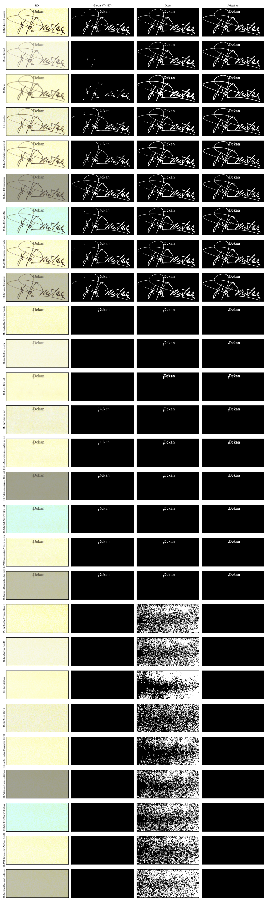
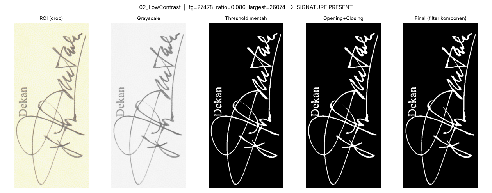
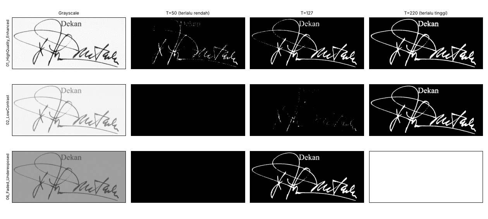
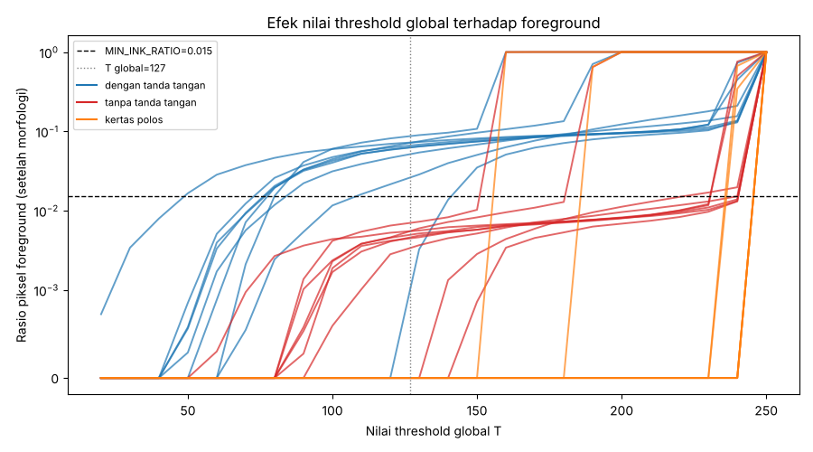

# Mini Project — Deteksi Keberadaan Tanda Tangan (Thresholding & Morfologi)

Sistem sederhana berbasis pengolahan citra klasik (OpenCV) untuk memutuskan apakah
sebuah dokumen sudah ditandatangani pejabat berwenang:

```
SIGNATURE PRESENT   atau   SIGNATURE ABSENT
```

Dataset: 9 hasil scan ijazah yang sama dengan 9 jenis degradasi (kontras rendah, blur,
noise, resolusi rendah, pudar/gelap, pergeseran warna, artefak JPEG, kombinasi).
Tanda tangan yang dianalisis adalah tanda tangan **pimpinan penandatangan dokumen
(Dekan)** — padanan "kepala sekolah" pada ijazah perguruan tinggi. ROI Rektor juga
disediakan (`--roi rektor`).

---

## 1. Struktur repository

```
signature-detection/
├── data/
│   ├── with_signature/     # 9 scan asli (ada tanda tangan)
│   └── no_signature/       # 9 scan tanpa tanda tangan (dibuat oleh make_negatives.py)
├── src/
│   ├── detector.py         # inti pipeline: crop, gray, threshold, morfologi, fitur, aturan
│   ├── make_negatives.py   # sintesis citra uji tanpa tanda tangan
│   ├── run_experiment.py   # menjalankan seluruh eksperimen + membuat grafik
│   └── detect.py           # CLI untuk menguji citra apa pun
├── outputs/                # hasil eksperimen (CSV, tabel, gambar)
├── requirements.txt
└── README.md
```

## 2. How to run

### Prasyarat
- Python 3.9 atau lebih baru
- pip

### Langkah

```bash
# 1. clone
git clone https://github.com/<username>/signature-detection.git
cd signature-detection

# 2. (opsional) virtual environment
python -m venv .venv
source .venv/bin/activate          # Windows: .venv\Scripts\activate

# 3. install dependensi
pip install -r requirements.txt

# 4. buat citra uji TANPA tanda tangan (sudah tersedia di repo; jalankan ulang bila perlu)
python src/make_negatives.py

# 5. jalankan seluruh eksperimen (3 metode threshold x 27 sampel uji)
python src/run_experiment.py
#    opsi: --method global|otsu|adaptive  (metode untuk gambar outputs/pipeline/)

# 6. uji satu / beberapa citra secara langsung
python src/detect.py data/with_signature/01_HighQuality_Enhanced_1.jpg
python src/detect.py data/no_signature/*.jpg
python src/detect.py data/with_signature/02_LowContrast_1.jpg --method global
python src/detect.py scan_saya.jpg --save hasil.png        # simpan visualisasi
python src/detect.py potongan_ttd.png --cropped            # input sudah berupa crop
```

Contoh keluaran `detect.py`:

```
data/with_signature/06_Faded_Underexposed_1.jpg
  metode=adaptive  fg_pixels=26670  ink_ratio=0.0836  komponen=5  komponen_terbesar=25306
  ==> SIGNATURE PRESENT
data/no_signature/06_Faded_Underexposed_1_NOSIG.jpg
  metode=adaptive  fg_pixels=2110  ink_ratio=0.0066  komponen=5  komponen_terbesar=754
  ==> SIGNATURE ABSENT
```

### File keluaran (`outputs/`)

| File | Isi |
|---|---|
| `results.csv` | fitur lengkap tiap citra × metode (fg pixels, rasio, komponen, keputusan) |
| `summary.md` | tabel akurasi dan detail per citra |
| `crops/` | ROI hasil crop |
| `pipeline/*.png` | tahapan per citra: crop → grayscale → threshold → morfologi → final |
| `compare_methods.png` | perbandingan global vs Otsu vs adaptive untuk semua sampel |
| `threshold_sweep.png` | rasio foreground vs nilai threshold T (0–255) |
| `threshold_extremes.png` | contoh visual T terlalu rendah / sedang / terlalu tinggi |

> Untuk citra dengan ukuran atau tata letak berbeda, sesuaikan koordinat `ROIS`
> di `src/detector.py`. ROI otomatis diskalakan bila hanya resolusinya yang berbeda.

---

## 3. Metode

| Tahap | Implementasi | Alasan |
|---|---|---|
| Crop ROI | `ROIS["dekan"] = (1650, 440, 2030, 1280)` | Hanya area tanda tangan yang dianalisis; teks lain diabaikan |
| Grayscale | `cv2.cvtColor(BGR2GRAY)` | Warna kertas (kuning/hijau/abu) tidak relevan; yang penting kecerahan tinta vs kertas |
| Denoise | median blur 3×3 | Meredam grain/noise sebelum threshold |
| Threshold | **Global** T=127, **Otsu**, **Adaptive Gaussian** (blok 51, C=15) | Tiga pendekatan dibandingkan |
| Morfologi | **Opening** 3×3 lalu **Closing** 5×5 | Opening membuang bintik noise; closing menyambung goresan yang putus |
| Filter komponen | buang komponen < 80 piksel | Sisa noise yang lolos opening |
| Fitur | jumlah piksel foreground, ink ratio, jumlah komponen, luas komponen terbesar, bbox coverage | |
| Aturan | lihat bawah | |

### Aturan keputusan

```
SIGNATURE PRESENT  jika  ink_ratio >= 0.015        (≥ 1,5 % ROI berupa tinta)
                    dan  largest_component >= 3000 (ada goresan panjang yang menyambung)
selain itu         SIGNATURE ABSENT
```

Ambang dipilih dari data: ROI bertanda tangan memiliki ink ratio 0,08–0,11 dan komponen
terbesar ≥ 25.000 piksel, sedangkan ROI tanpa tanda tangan hanya berisi teks cetak
"Dekan" (ratio ≈ 0,007, komponen terbesar < 1.100). Ambang diletakkan jauh dari kedua
kelompok sehingga ada margin aman. Syarat **komponen terbesar** penting: teks cetak atau
noise tersebar bisa menaikkan jumlah piksel, tetapi tidak membentuk satu goresan panjang
seperti tanda tangan.

### Data uji

| Kelompok | Jumlah | Keterangan |
|---|---|---|
| Ada tanda tangan | 9 | scan asli, 9 jenis degradasi |
| Tanpa tanda tangan | 9 | scan yang sama; goresan tanda tangan dihapus dengan *inpainting* dan tekstur noise kertas dikembalikan, teks "Dekan" tetap ada (meniru formulir yang belum ditandatangani) |
| Kertas polos | 9 | ROI berukuran sama dari margin kosong tiap scan (kasus ekstrem: tidak ada tinta sama sekali) |

---

## 4. Hasil

| Metode | Benar | Akurasi | TP | TN | FP | FN |
|---|---|---|---|---|---|---|
| Global (T=127) | 25/27 | 93 % | 7 | 18 | 0 | 2 |
| Otsu | 18/27 | 67 % | 9 | 9 | 9 | 0 |
| **Adaptive** | **27/27** | **100 %** | 9 | 18 | 0 | 0 |

Jumlah piksel foreground (setelah morfologi) untuk beberapa kasus menarik:

| Citra | Global | Otsu | Adaptive |
|---|---|---|---|
| 01 HighQuality (ada TTD) | 23.101 ✅ | 27.114 ✅ | 28.573 ✅ |
| 02 LowContrast (ada TTD) | **396 ❌** | 27.163 ✅ | 27.478 ✅ |
| 03 Blurred (ada TTD) | **8.423 ❌** | 37.944 ✅ | 33.731 ✅ |
| 06 Faded/Underexposed (ada TTD) | 27.948 ✅ | 27.228 ✅ | 26.670 ✅ |
| 01 HighQuality (tanpa TTD) | 1.751 ✅ | 2.195 ✅ | 2.311 ✅ |
| 01 HighQuality (kertas polos) | 0 ✅ | **171.140 ❌** | 0 ✅ |

Tabel lengkap: [`outputs/summary.md`](outputs/summary.md) dan [`outputs/results.csv`](outputs/results.csv).



### Perbandingan metode

- **Global (T tetap = 127)** — sederhana dan cepat, tetapi satu nilai T tidak cocok untuk
  semua kondisi scan. Pada citra *low contrast* tinta abu-abu muda (intensitas sebagian besar 130–190, median ≈ 150)
  berada **di atas** T sehingga hampir seluruh tanda tangan hilang (hanya 396 piksel).
  Pada citra *blurred* tepi goresan melebar dan memudar sehingga goresan terputus-putus.
  Dua tanda tangan gagal terdeteksi (false negative).
- **Otsu** — memilih T otomatis dari histogram (T berkisar 124–207 sesuai kecerahan citra),
  jadi seluruh tanda tangan terdeteksi meskipun kontras rendah atau gambar gelap. Namun
  Otsu **selalu** membagi histogram menjadi dua kelas walaupun sebenarnya hanya ada satu
  (kertas). Pada ROI kertas polos, Otsu memilih T ≈ 240–248 sehingga tekstur kertas
  dianggap tinta → 35–65 % ROI menjadi foreground → 9 false positive.
- **Adaptive (Gaussian)** — piksel dibandingkan dengan rata-rata lokal dikurangi C. Tidak
  terpengaruh kecerahan global, warna kertas, maupun vignetting, dan konstanta C mencegah
  variasi tekstur kertas kecil dianggap tinta. Satu-satunya metode yang benar di semua
  27 sampel, sehingga dijadikan **metode default**.

Contoh tahapan pipeline (citra kontras rendah, metode adaptive):



---

## 5. Analisis

### Mengapa thresholding diperlukan sebelum menganalisis keberadaan tanda tangan?

1. **Memisahkan objek dari latar.** Citra grayscale berisi 256 tingkat keabuan; kertas,
   pola guilloche pengaman, noise, dan tinta bercampur di rentang nilai yang berdekatan.
   Thresholding mengubahnya menjadi dua kelas yang tegas — *tinta* (foreground) dan
   *kertas* (background) — sehingga "tanda tangan ada atau tidak" bisa diukur dengan
   angka yang jelas, misalnya jumlah piksel foreground.
2. **Fitur bentuk hanya terdefinisi pada citra biner.** Operasi morfologi (opening,
   closing), *connected component labeling*, luas komponen terbesar, dan bounding box
   semuanya membutuhkan citra biner.
3. **Menghilangkan pengaruh kondisi scan.** Tanpa threshold, rata-rata intensitas ROI
   lebih ditentukan oleh warna kertas/eksposur daripada keberadaan tinta. Contohnya ROI
   *faded/underexposed* tanpa tanda tangan jauh lebih gelap daripada ROI *high quality*
   yang ada tanda tangannya — fitur intensitas mentah akan menyimpulkan sebaliknya.
4. **Data jadi ringkas dan aturan jadi sederhana.** Satu aturan berbasis hitungan piksel
   dan komponen cukup untuk memutuskan PRESENT/ABSENT.

### Apa masalahnya jika threshold terlalu tinggi atau terlalu rendah?

(Konvensi: piksel dengan intensitas < T dianggap tinta.)



**Threshold terlalu rendah (mis. T = 50)** — hanya piksel yang sangat gelap yang dihitung
sebagai tinta.
- Goresan tipis, tinta pudar, dan tepi goresan hilang; tanda tangan terpecah menjadi
  potongan kecil yang kemudian ikut terhapus oleh opening/filter komponen.
- Pada citra kontras rendah dan *faded*, hasilnya **kosong sama sekali**.
- Akibat: **false negative** — dokumen yang sudah ditandatangani dinyatakan
  SIGNATURE ABSENT. Contoh nyata di eksperimen ini: T = 127 sudah "terlalu rendah" untuk
  citra *low contrast* (396 piksel saja).

**Threshold terlalu tinggi (mis. T = 220)** — piksel yang cukup terang pun dihitung
sebagai tinta.
- Goresan menebal, saling menempel, dan teks cetak di sekitarnya ikut tersegmentasi.
- Latar kertas yang agak gelap (scan *underexposed*), pola guilloche, noise, dan bayangan
  ikut menjadi foreground. Pada citra *faded* seluruh ROI menjadi putih (100 % foreground).
- Akibat: **false positive** — dokumen yang belum ditandatangani pun dinyatakan
  SIGNATURE PRESENT, karena jumlah piksel foreground melampaui batas aturan.



Grafik sweep memperlihatkan bahwa rentang T yang "aman" (kurva biru di atas garis
putus-putus, kurva merah/oranye di bawahnya) **berbeda untuk setiap citra** dan
pada beberapa citra sangat sempit. Itulah alasan threshold tetap rapuh, dan mengapa
threshold yang menyesuaikan diri secara lokal (adaptive) paling stabil. Otsu juga
menyesuaikan diri, tetapi karena memaksa dua kelas, ia perlu pengaman tambahan
(misalnya memeriksa selisih rata-rata kedua kelas) bila ROI bisa benar-benar kosong.

---

## 6. Keterbatasan

- ROI berupa koordinat tetap; dokumen yang tergeser/terputar banyak perlu registrasi
  (mis. *template matching* pada logo) sebelum crop.
- Sampel negatif disintesis dari scan yang sama (inpainting), bukan scan dokumen yang
  benar-benar belum ditandatangani.
- Sistem hanya memeriksa **keberadaan** tanda tangan, bukan keaslian (verifikasi).

## 7. Catatan privasi

Data berisi dokumen pribadi (nama, tanggal lahir, foto, NPM, nomor ijazah). Simpan
repository ini sebagai **private**, atau ganti isi `data/` dengan dokumen contoh
sebelum dipublikasikan.
